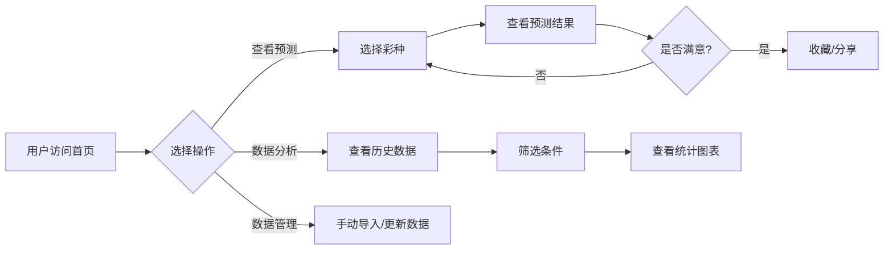
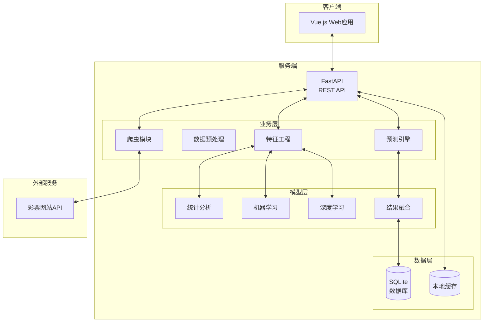
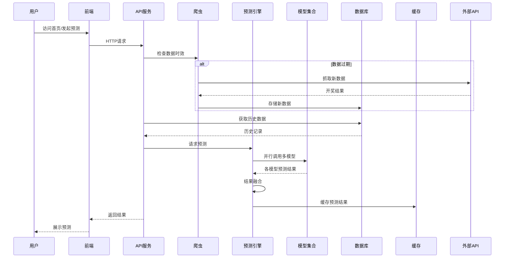

# 彩票预测系统 PRD 文档

> 版本: v1.0.2
> 创建日期: 2026-02-23
> 状态: 开发中

---

## v1.0.2 版本更新记录 (2026-02-23)

### 新增功能：数据分析增强

在现有数据分析功能基础上，增加更多统计分析维度，帮助用户更好地了解号码走势规律。

#### 新增图表

- **号码遗漏值分布**: 显示各号码的遗漏期数分布
- **尾数分布**: 统计红球个位数的出现频率
- **和值分布**: 统计红球号码总和的区间分布
- **连号统计**: 统计相邻号码同时出现的频率

---

### ASCII 原型图

#### 数据分析页面（增强后）

```
┌─────────────────────────────────────────────────────────────────┐
│                       数据分析                                   │
│                查看历史数据统计，了解号码走势                       │
└─────────────────────────────────────────────────────────────────┘

┌─────────────────────────────────────────────────────────────────┐
│  选择彩种: [双色球 ▼]   数据范围: [最近100期 ▼]                │
└─────────────────────────────────────────────────────────────────┘

┌──────────────────────────────────────────────────────────────────┐
│                      统计概览                                    │
├─────────────────┬─────────────────┬─────────────────────────────┤
│   📊 历史期数   │   🔥 红球热号    │   ❄️ 红球冷号              │
│     100 期     │  17,22,08,30,26 │   01,03,11,14,25          │
├─────────────────┴─────────────────┴─────────────────────────────┤
│   🔵 蓝球热号: 07,12,14     |   🌟 蓝球冷号: 02,06,10          │
└──────────────────────────────────────────────────────────────────┘

┌───────────────────────────┐  ┌───────────────────────────────┐
│    红球出现频率 TOP20    │  │      蓝球出现频率             │
│  [███████████████████]   │  │  [███████████████████]       │
└───────────────────────────┘  └───────────────────────────────┘

┌───────────────────────────┐  ┌───────────────────────────────┐
│      奇偶比分布           │  │       区间分布 (红球)           │
│     ┌───┐               │  │  [█████████████████]           │
│    ╱ 2:4 ╲              │  │  1-11  ████████████████        │
│   │3:3◉──╲  45%        │  │  12-22 ████████████████        │
│    ╲4:2──╱             │  │  23-33 ████████████░░░         │
│     └───┘               │  │                                │
└───────────────────────────┘  └───────────────────────────────┘

┌───────────────────────────┐  ┌───────────────────────────────┐
│      号码遗漏值           │  │       尾数分布                │
│  [███████████████████]   │  │  [███████████████████]       │
│  01  ███████████  15期   │  │  7尾 █████████████████        │
│  02  ██████████░░  10期   │  │  2尾 ██████████████░          │
│  03  ████████░░░░   8期   │  │  8尾 ████████████░░░          │
└───────────────────────────┘  └───────────────────────────────┘

┌───────────────────────────┐  ┌───────────────────────────────┐
│      和值分布             │  │       连号统计                 │
│  [███████████████████]    │  │  [███████████████████]        │
│  80-89  ██████████  12   │  │  无连号 █████████████           │
│  90-99  ███████████  15   │  │  2连号 ████████████            │
│ 100-109 ████████░░░   8   │  │  3连号 ██████░░░░░░          │
└───────────────────────────┘  └───────────────────────────────┘
```

---

### 技术架构更新

#### 后端 statistical.py 新增分析方法

```python
# 新增分析方法
def analyze_missing_distribution(self, records) -> Dict[int, int]:
    """分析号码遗漏值分布"""

def analyze_tail(self, records) -> Dict[str, int]:
    """分析号码尾数分布"""

def analyze_sum(self, records) -> Dict[str, int]:
    """分析红球和值分布"""

def analyze_consecutive(self, records) -> Dict[str, int]:
    """分析连号出现情况"""
```

#### API 响应新增字段

```json
{
  "missing_distribution": {...},
  "tail_distribution": {...},
  "sum_distribution": {...},
  "consecutive_stats": {...}
}
```

---

### 非影响模块

以下现有模块不受本次更新影响：

- `frontend/src/views/Home.vue` - 首页
- `frontend/src/views/Predict.vue` - 预测页
- `frontend/src/views/Verify.vue` - 验证页
- `frontend/src/router.js` - 路由配置
- `frontend/src/App.vue` - 导航组件
- `backend/app/core/database.py` - 数据库
- `backend/app/api/lottery.py` - API路由
- `backend/app/services/verifier.py` - 验证服务
- `backend/app/services/crawler/` - 爬虫模块
- `frontend/src/api/index.js` - API接口

---

### 修改文件清单

| 序号 | 文件 | 操作 | 说明 |
|:----:|------|:----:|------|
| 1 | backend/app/services/predictor/statistical.py | 修改 | 添加4个新分析方法 |
| 2 | frontend/src/views/Analysis.vue | 修改 | 添加4个新图表 |

---

## v1.0.1 版本更新记录 (2026-02-23)

### 新增功能：历史预测验证

允许用户保存预测号码，并与历史开奖记录批量比对，统计中奖率和中奖分布。

#### 功能特性

- **保存预测**: 将生成的预测号码保存到本地数据库
- **批量验证**: 将保存的预测与历史开奖结果逐一比对
- **中奖统计**: 统计各奖级中奖次数和中奖率
- **明细查看**: 查看每注预测的具体中奖情况

---

### ASCII 原型图

#### 预测页面（修改后）

```
┌─────────────────────────────────────────────────────────────────┐
│                         彩票预测                                 │
│                  基于历史数据的统计分析，生成预测号码              │
└─────────────────────────────────────────────────────────────────┘

┌─────────────────────────────────────────────────────────────────┐
│  选择彩种: [双色球 ▼]                                            │
│  预测方法: ⦿ 频率分析  ○ 冷热号  ○ 遗漏值  ○ 随机              │
│  预测注数: [━━━●━━━━━━] 5                                       │
│            [生成预测]                                            │
└─────────────────────────────────────────────────────────────────┘

                         预测结果
┌──────────────────────┐  ┌──────────────────────┐
│ 第 1 注   [频率分析]  │  │ 第 2 注   [频率分析]  │
│ 红球: 01 05 12 18 24 33 │  │ 红球: 03 06 15 19 25 31 │
│ 蓝球: 07              │  │ 蓝球: 12              │
│ [保存此注] [删除]     │  │ [保存此注] [删除]     │
└──────────────────────┘  └──────────────────────┘

┌─────────────────────────────────────────────────────────────────┐
│  [💾 保存所有预测]  [🔍 查看已保存的预测]                        │
└─────────────────────────────────────────────────────────────────┘
```

#### 验证页面（新增）

```
┌─────────────────────────────────────────────────────────────────┐
│                      历史预测验证                                 │
└─────────────────────────────────────────────────────────────────┘

┌─────────────────────────────────────────────────────────────────┐
│  彩种: [双色球 ▼]   验证范围: [最近100期 ▼]                      │
│  [🔍 开始验证]  [📊 查看统计]  [🗑️ 清空预测]                    │
└─────────────────────────────────────────────────────────────────┘

                    我的预测记录 (共 15 注)
┌──────────────────────────────────────────────────────────────────┐
│ ID  │ 红球              │ 蓝球  │ 方法     │ 创建时间          │
├─────┼───────────────────┼───────┼──────────┼───────────────────┤
│ 001 │ 01,05,12,18,24,33 │ 07    │ 频率分析 │ 2026-02-20 10:30 │
│ ... │ ...               │ ...   │ ...      │ ...               │
└─────┴───────────────────┴───────┴──────────┴───────────────────┘

                        验证结果统计
┌─────────────────────────────────────────────────────────────────┐
│  总预测注数: 15 注   验证期数: 100 期   总验证次数: 1500 次     │
│                                                                  │
│  中奖统计:                                                       │
│  ├─ 一等奖 (6+1): 0 次   (0.00%)                               │
│  ├─ 二等奖 (6+0): 0 次   (0.00%)                               │
│  ├─ 三等奖 (5+1): 2 次   (0.13%)                               │
│  ├─ 四等奖 (5+0/4+1): 15 次  (1.00%)                          │
│  ├─ 五等奖 (4+0/3+1): 87 次  (5.80%)                          │
│  └─ 六等奖 (2+1/1+1/0+1): 245 次 (16.33%)                     │
│                                                                  │
│  总中奖率: 23.27%                                                │
└─────────────────────────────────────────────────────────────────┘
```

---

### 技术架构更新

#### 新增数据库表

```sql
CREATE TABLE user_predictions (
    id INTEGER PRIMARY KEY AUTOINCREMENT,
    lottery_type TEXT NOT NULL,
    red_balls TEXT NOT NULL,
    blue_balls TEXT NOT NULL,
    method TEXT NOT NULL,
    created_at TEXT NOT NULL
);
```

#### 新增 API 端点

| 方法 | 路径 | 说明 |
|------|------|------|
| POST | /api/lottery/predictions | 保存预测号码 |
| GET | /api/lottery/predictions/{type} | 获取预测列表 |
| DELETE | /api/lottery/predictions/{type} | 清空预测记录 |
| POST | /api/lottery/verify | 执行验证 |
| GET | /api/lottery/verification-stats/{type} | 获取验证统计 |

#### 中奖等级判定规则

**双色球 (SSQ)**

| 奖级 | 红球匹配 | 蓝球匹配 |
|:----:|:--------:|:--------:|
| 一等奖 | 6 | 1 |
| 二等奖 | 6 | 0 |
| 三等奖 | 5 | 1 |
| 四等奖 | 5 | 0 或 4 | 1 |
| 五等奖 | 4 | 0 或 3 | 1 |
| 六等奖 | 2 | 1 或 1 | 1 或 0 | 1 |

**大乐透 (DLT)**

| 奖级 | 前区匹配 | 后区匹配 |
|:----:|:--------:|:--------:|
| 一等奖 | 5 | 2 |
| 二等奖 | 5 | 1 |
| 三等奖 | 5 | 0 |
| 四等奖 | 4 | 2 |
| 五等奖 | 4 | 1 |
| 六等奖 | 4 | 0 或 3 | 2 |
| 七等奖 | 3 | 2 或 3 | 1 |
| 八等奖 | 3 | 0 或 2 | 1 或 1 | 2 |
| 九等奖 | 2 | 0 或 1 | 1 或 0 | 2 |

---

### 非影响模块

以下现有模块不受本次更新影响：

- `frontend/src/views/Home.vue` - 首页
- `frontend/src/views/Analysis.vue` - 数据分析页
- `backend/app/services/crawler/` - 爬虫模块
- `backend/app/services/predictor/` - 预测引擎
- `frontend/package.json` - 依赖配置

---

### 修改文件清单

| 序号 | 文件 | 操作 |
|:----:|------|:----:|
| 1 | backend/app/core/database.py | 修改 |
| 2 | backend/app/services/verifier.py | 新建 |
| 3 | backend/app/api/lottery.py | 修改 |
| 4 | frontend/src/api/index.js | 修改 |
| 5 | frontend/src/views/Predict.vue | 修改 |
| 6 | frontend/src/views/Verify.vue | 新建 |
| 7 | frontend/src/router.js | 修改 |
| 8 | frontend/src/App.vue | 修改 |

---

# 原始 v1.0 文档

> 版本: v1.0 (MVP)
> 创建日期: 2026-02-23
> 状态: 待确认

---

## 1. 产品概述

### 1.1 产品定位

中国福利彩票预测分析系统 - 面向彩票爱好者的智能预测工具

### 1.2 核心价值

- **自动化数据采集**: 自动抓取历史开奖数据，无需手动维护
- **多模型融合预测**: 结合传统统计与机器学习/深度学习方法
- **可视化分析**: 直观展示历史趋势和预测结果
- **本地化部署**: 数据本地存储，保护用户隐私

### 1.3 目标用户

- 彩票研究爱好者
- 数据分析学习者
- 对彩票预测感兴趣的技术人员

---

## 2. 功能需求

### 2.1 MVP 功能列表

| 优先级 | 功能模块 | 功能描述 |
|:------:|----------|----------|
| P0 | 彩票数据采集 | 自动抓取双色球、大乐透、七乐彩历史开奖数据 |
| P0 | 数据存储管理 | 本地SQLite数据库存储历史数据 |
| P0 | 基础预测功能 | 基于统计方法的号码预测 |
| P0 | 预测结果展示 | Web界面展示预测号码 |
| P1 | 高级预测功能 | 机器学习/深度学习模型预测 |
| P1 | 历史数据分析 | 号码出现频率、奇偶比、跨度等统计 |
| P1 | 可视化图表 | 历史走势图表、预测置信度展示 |
| P2 | 预测结果收藏 | 收藏预测结果以便回顾 |
| P2 | 多彩种支持 | 类型 |

### 扩展支持更多彩票2.2 用户流程图



---

## 3. 架构设计

### 3.1 系统架构图



### 3.2 核心模块说明

| 模块 | 职责 | 主要文件 |
|------|------|----------|
| `crawler/` | 数据爬取 | `spider.py`, `parser.py` |
| `preprocess/` | 数据清洗 | `cleaner.py`, `validator.py` |
| `features/` | 特征提取 | `statistical.py`, `nlp_features.py` |
| `models/statistical/` | 统计模型 | `frequency.py`, `trend.py` |
| `models/ml/` | 机器学习 | `random_forest.py`, `xgboost.py` |
| `models/dl/` | 深度学习 | `lstm.py`, `transformer.py` |
| `predictor/` | 结果融合 | `ensemble.py`, `voting.py` |
| `api/` | Web接口 | `routes.py`, `schemas.py` |

### 3.3 数据流设计



---

## 4. 界面设计 (MVP)

### 4.1 页面结构

| 页面 | 功能 |
|------|------|
| 首页 | 展示热门预测、快捷入口 |
| 预测页 | 选择彩种、查看预测结果 |
| 数据分析页 | 历史数据查询、统计图表 |
| 数据管理页 | 手动导入、批量更新 |

### 4.2 原型图说明

#### 预测结果展示区

```
┌─────────────────────────────────────────┐
│  🎯 双色球 2026年第025期预测            │
├─────────────────────────────────────────┤
│  红球: 03  08  15  19  24  32          │
│  蓝球: 07                                  │
├─────────────────────────────────────────┤
│  置信度: ████████░░ 78%                  │
│  算法: 融合模型 (统计+ML+DL)             │
├─────────────────────────────────────────┤
│  [📊 历史命中率] [⭐ 收藏] [🔄 重新预测]  │
└─────────────────────────────────────────┘
```

---

## 5. 技术选型

### 5.1 技术栈

| 层级 | 技术 | 版本 |
|------|------|------|
| 后端框架 | FastAPI | 0.109+ |
| 数据库 | SQLite | 3.x |
| 爬虫 | httpx + BeautifulSoup | latest |
| ML | Scikit-learn | 1.4+ |
| DL | PyTorch | 2.0+ |
| 前端 | Vue3 | 3.4+ |
| 图表 | ECharts | 5.x |
| UI组件 | Element Plus | 2.5+ |

### 5.2 目录结构

```
predict_Lottery_ticket/
├── backend/
│   ├── app/
│   │   ├── api/           # API路由
│   │   ├── core/          # 核心配置
│   │   ├── models/        # 数据模型
│   │   ├── schemas/       # Pydantic模型
│   │   └── services/      # 业务逻辑
│   │       ├── crawler/   # 爬虫模块
│   │       ├── features/ # 特征工程
│   │       ├── ml/        # 机器学习
│   │       ├── dl/        # 深度学习
│   │       └── predictor/ # 预测聚合
│   ├── data/              # 数据存储
│   ├── models/            # 训练好的模型
│   └── main.py            # 入口文件
├── frontend/
│   ├── src/
│   │   ├── views/        # 页面
│   │   ├── components/   # 组件
│   │   ├── api/          # API调用
│   │   └── stores/       # 状态管理
│   └── index.html
└── requirements.txt
```

---

## 6. 风险与限制

### 6.1 已知风险

| 风险 | 影响 | 缓解措施 |
|------|------|----------|
| 彩票预测本质是随机事件 | 预测准确性无法保证 | 明确告知用户仅供娱乐参考 |
| 网络爬取可能被封 | 数据更新受阻 | 添加代理池、请求间隔 |
| 模型过拟合 | 预测效果下降 | 交叉验证、持续迭代 |

### 6.2 免责声明

> **⚠️ 重要提示**
> 彩票开奖是完全随机的概率事件，任何预测方法都无法保证准确率。
> 本系统仅供学习研究娱乐使用，不构成任何投注建议。
> 请理性购彩，切勿沉迷。

---

## 7. 产品路线图

### 7.1 MVP (v1.0) - 当前阶段

- [ ] 基础Web框架搭建
- [ ] 数据爬取模块
- [ ] SQLite数据存储
- [ ] 统计预测方法
- [ ] 基础Web前端
- [ ] 预测结果展示

### 7.2 v1.1 规划

- [ ] 机器学习模型集成
- [ ] 历史数据分析图表
- [ ] 预测结果收藏功能

### 7.3 v1.2 规划

- [ ] 深度学习模型集成
- [ ] 多彩种支持
- [ ] 结果分享功能

### 7.4 长期规划

- [ ] Docker容器化部署
- [ ] Redis缓存优化
- [ ] 用户系统
- [ ] 定时自动预测

---

## 8. 验收标准

### 8.1 MVP 验收条件

| 条件 | 验证方式 |
|------|----------|
| 能成功抓取双色球历史数据 | 运行爬虫，检查数据库有数据 |
| 能基于统计方法生成预测号码 | 访问预测API，返回6+1格式号码 |
| Web界面能展示预测结果 | 浏览器访问，页面正常渲染 |
| 能查看历史开奖数据 | 前端数据列表页可查看 |
| 能查看基本统计图表 | 前端图表正常展示 |

---

## 附录

### A. 数据字段定义

| 字段 | 类型 | 说明 |
|------|------|------|
| lottery_type | string | 彩种: ssq, dlt, qlc |
| issue | string | 期号: 2026025 |
| red_balls | string | 红球: "03,08,15,19,24,32" |
| blue_ball | string | 蓝球: "07" |
| open_date | date | 开奖日期 |
| created_at | datetime | 记录创建时间 |

### B. API 接口列表

| 方法 | 路径 | 说明 |
|------|------|------|
| GET | /api/lottery/types | 获取支持的彩种 |
| GET | /api/lottery/{type}/history | 获取历史开奖 |
| POST | /api/predict/{type} | 发起预测 |
| GET | /api/analysis/{type} | 获取分析数据 |
| POST | /api/crawler/fetch | 手动触发抓取 |

---

**文档状态**

- [ ] 产品需求确认
- [ ] 技术方案确认
- [ ] 架构设计确认
- [ ] MVP原型确认

> 确认后请回复"已确认"锁定需求
